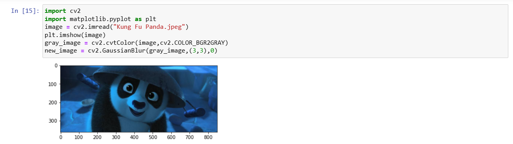
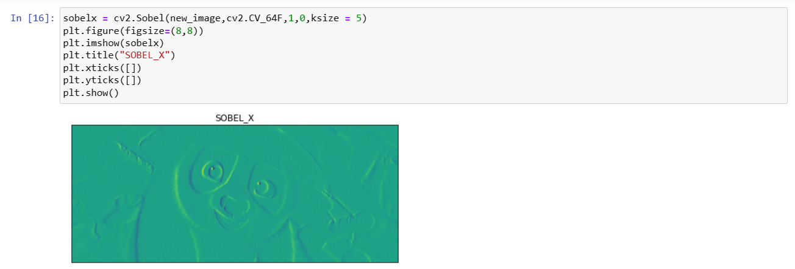
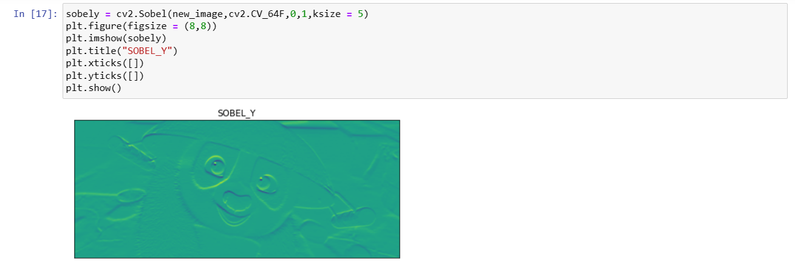
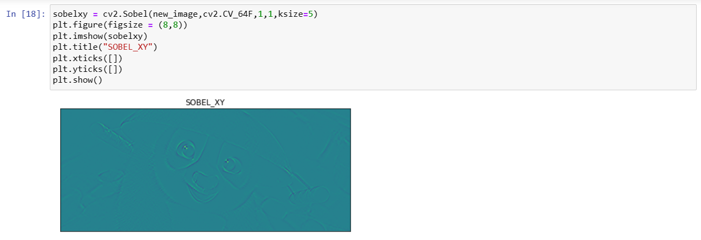
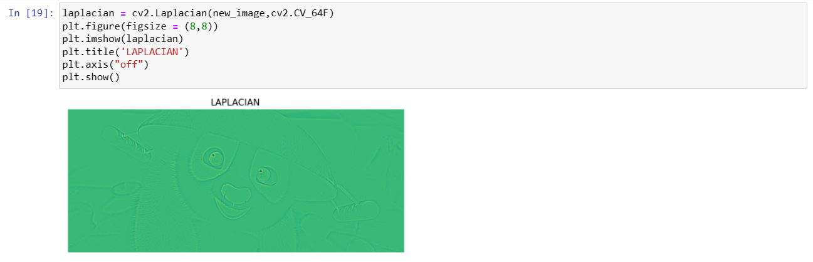
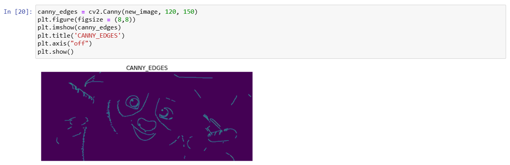

# EDGE DETECTION
## AIM:
To perform edge detection using Sobel, Laplacian, and Canny edge detectors.

## SOFTWARE REQUIRED:
Anaconda - Python 3.7

## ALGORITHM:
### STEP 1:
Import the required packages for further process.

### STEP 2:
Read the image and convert the bgr image to gray scale image.

### STEP 3:
Use any filters for smoothing the image to reduse the noise.

### STEP 4:
Apply the respective filters -Sobel,Laplacian edge dectector and Canny edge dector.

### STEP 5:
Display the filtered image using plot and imshow.

## PROGRAM:

```
NAME  : Paarkavy B
REG.NO: 212221230072 
```

### IMPORT THE PACKAGES AND LOAD THE IMAGE,CONVERT TO GRAYSCALE AND REMOVE NOISE
```
import cv2
import matplotlib.pyplot as plt
image = cv2.imread("Kung Fu Panda.jpeg")
plt.imshow(image)
gray_image = cv2.cvtColor(image,cv2.COLOR_BGR2GRAY)
new_image = cv2.GaussianBlur(gray_image,(3,3),0)
```

### SOBEL EDGE DETECTOR
```
sobelx = cv2.Sobel(new_image,cv2.CV_64F,1,0,ksize = 5)
plt.figure(figsize=(8,8))
plt.imshow(sobelx)
plt.title("SOBEL_X")
plt.xticks([])
plt.yticks([])
plt.show()
```

```
sobely = cv2.Sobel(new_image,cv2.CV_64F,0,1,ksize = 5)
plt.figure(figsize = (8,8))
plt.imshow(sobely)
plt.title("SOBEL_Y")
plt.xticks([])
plt.yticks([])
plt.show()
```

```
sobelxy = cv2.Sobel(new_image,cv2.CV_64F,1,1,ksize=5)
plt.figure(figsize = (8,8))
plt.imshow(sobelxy)
plt.title("SOBEL_XY")
plt.xticks([])
plt.yticks([])
plt.show()
```

### LAPLACIAN EDGE DETECTOR
```
laplacian = cv2.Laplacian(new_image,cv2.CV_64F)
plt.figure(figsize = (8,8))
plt.imshow(laplacian)
plt.title('LAPLACIAN')
plt.axis("off")
plt.show()
```

### CANNY EDGE DETECTOR
```
canny_edges = cv2.Canny(new_image, 120, 150)
plt.figure(figsize = (8,8))
plt.imshow(canny_edges)
plt.title('CANNY_EDGES')
plt.axis("off")
plt.show()
```

## OUTPUT:
### ORIGINAL:



### SOBEL EDGE DETECTOR:







### LAPLACIAN EDGE DETECTOR:



### CANNY EDGE DETECTOR:



## RESULT:
Thus,the edges are detected using Sobel, Laplacian, and Canny edge detectors.
